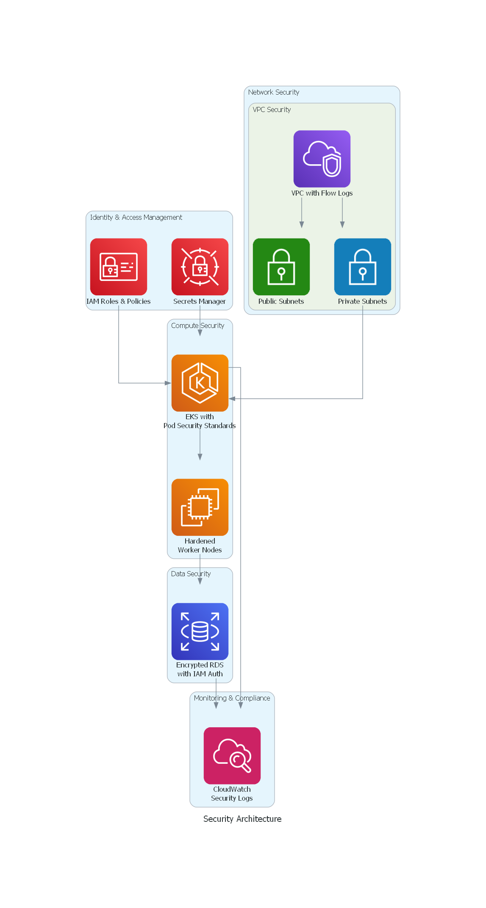

# Innovate Inc. Cloud Architecture Design Document

## Executive Summary

This document presents a comprehensive cloud architecture design for Innovate Inc.'s web application deployment on Amazon Web Services (AWS). The solution is designed to scale from hundreds to millions of users while maintaining security, cost-effectiveness, and operational excellence.

## Architecture Overview

The proposed architecture leverages AWS managed services with a multi-account strategy, containerized applications on Amazon EKS, and robust security for handling sensitive user data.

## 1. Cloud Environment Structure

### Recommended AWS Account Strategy

We recommend a **4-account structure** following AWS best practices:

#### Production Account (`innovate-prod`)
- **Purpose**: Hosts production workloads and customer-facing services
- **Resources**: Production EKS cluster, Multi-AZ RDS PostgreSQL, production VPC
- **Justification**: Complete isolation ensures production stability and security

#### Development/Staging Account (`innovate-dev`)
- **Purpose**: Development, testing, and staging environments
- **Resources**: Smaller EKS cluster, single-AZ RDS for cost optimization
- **Justification**: Prevents development activities from affecting production

#### Shared Services Account (`innovate-shared`)
- **Purpose**: Common services shared across environments
- **Resources**: Amazon ECR repositories, AWS Secrets Manager, shared tooling
- **Justification**: Centralized management reduces duplication and costs

#### Security/Audit Account (`innovate-security`)
- **Purpose**: Centralized logging, monitoring, and compliance
- **Resources**: AWS CloudTrail, AWS Config, CloudWatch Logs aggregation
- **Justification**: Independent security monitoring ensures compliance

### Benefits
- **Blast Radius Limitation**: Issues in one account don't affect others
- **Granular Billing**: Clear cost attribution per environment
- **Enhanced Security**: Account-level isolation provides strong boundaries
- **Compliance**: Easier regulatory compliance with clear separation

## 2. Network Design

### VPC Architecture

#### Production VPC (`10.0.0.0/16`)

**Public Subnets** (Internet-facing):
- `10.0.1.0/24` - AZ-A (ALB, NAT Gateway)
- `10.0.2.0/24` - AZ-B (NAT Gateway)

**Private Subnets** (Applications):
- `10.0.10.0/24` - AZ-A (EKS nodes)
- `10.0.11.0/24` - AZ-B (EKS nodes)

**Database Subnets** (Data layer):
- `10.0.20.0/24` - AZ-A (RDS primary)
- `10.0.21.0/24` - AZ-B (RDS standby)

### Network Security

**Defense in Depth Strategy:**
- **Security Groups**: Stateful rules controlling traffic between components
- **Network ACLs**: Additional subnet-level protection for database tier
- **VPC Flow Logs**: Comprehensive network traffic monitoring
- **AWS WAF**: Web application firewall protecting against common threats
- **Private Subnets**: Applications have no direct internet access
- **NAT Gateways**: Controlled outbound internet access for updates and APIs

## 3. Compute Platform

### Amazon EKS Configuration

#### EKS Cluster Setup
- **Version**: Kubernetes 1.28
- **Control Plane**: Managed by AWS with full logging enabled
- **Networking**: AWS VPC CNI for native VPC integration
- **Security**: Private API endpoint with restricted public access
- **Encryption**: Envelope encryption using AWS KMS

### Node Groups Strategy

#### Frontend Node Group (React SPA)
- **Instance Types**: t3.medium (primary), with spot instances for cost optimization
- **Scaling**: 2-20 nodes based on demand
- **Workload**: Serves static React application via nginx
- **Resource Profile**: Low CPU/memory requirements

#### Backend Node Group (Flask API)
- **Instance Types**: t3.large (primary), scalable to m5.large for performance
- **Scaling**: 2-50 nodes based on API load
- **Workload**: Python Flask REST API services
- **Resource Profile**: Higher CPU/memory for API processing

### Scaling and Resource Allocation

**Horizontal Pod Autoscaler (HPA)**:
- Frontend: Scale based on 70% CPU utilization (3-50 replicas)
- Backend: Scale based on 70% CPU + 80% memory (3-100 replicas)

**Cluster Autoscaler**:
- Automatically adjusts node count based on pod scheduling needs
- Optimizes costs by scaling down underutilized nodes
- Considers spot instance availability for cost savings

**Vertical Pod Autoscaler (VPA)**:
- Provides resource optimization recommendations
- Ensures right-sizing of container resource requests/limits

### Containerization Strategy

#### Image Management
- **Registry**: Amazon ECR with vulnerability scanning
- **Build Process**: Multi-stage Docker builds for optimization
- **Security**: Non-root containers with minimal base images
- **Lifecycle**: Automated cleanup of old images to control costs

#### Deployment Process
- **Strategy**: Rolling updates with blue-green capability
- **Health Checks**: Kubernetes liveness and readiness probes
- **Security Context**: Pod security standards enforcement
- **Resource Limits**: CPU and memory constraints for stability

## 4. Database Strategy

### Amazon RDS for PostgreSQL

#### Configuration
- **Engine**: PostgreSQL 15.4 with managed updates
- **Instance**: Start with db.t3.medium, scale to db.r6g.large
- **Multi-AZ**: Enabled for high availability
- **Storage**: GP3 SSD with encryption at rest
- **Network**: Private subnets only, no public access

#### High Availability
- **Multi-AZ Deployment**: Automatic failover to standby instance
- **Read Replicas**: Up to 5 replicas for read scaling
- **Connection Pooling**: PgBouncer for connection management
- **Backup Strategy**: 7-day automated backups with point-in-time recovery

#### Scaling Strategy
- **Vertical Scaling**: Instance class upgrades during maintenance windows
- **Horizontal Scaling**: Read replicas for read-heavy workloads
- **Storage Scaling**: Automatic storage scaling as data grows
- **Performance Monitoring**: AWS Performance Insights for optimization

#### Security
- **Encryption**: At rest (KMS) and in transit (SSL/TLS)
- **Access Control**: IAM database authentication
- **Network Isolation**: VPC security groups limiting access to EKS nodes only
- **Secrets Management**: Database credentials stored in AWS Secrets Manager

## 5. CI/CD Pipeline

### Pipeline Architecture
1. **Source**: GitHub repository triggers on commit
2. **Build**: AWS CodeBuild compiles and tests applications
3. **Security**: Container image vulnerability scanning
4. **Deploy to Dev**: Automated deployment to development environment
5. **Testing**: Automated integration tests in staging
6. **Approval**: Manual approval gate for production
7. **Deploy to Prod**: Blue-green deployment with health checks

### Deployment Strategy
- **GitOps**: ArgoCD for Kubernetes-native continuous delivery
- **Rollback**: Quick rollback capability using Git history
- **Feature Flags**: Gradual feature rollouts and A/B testing
- **Monitoring**: Real-time deployment monitoring and alerting

## 6. Security Framework

### Identity and Access Management
- **RBAC**: Kubernetes role-based access control
- **IRSA**: IAM Roles for Service Accounts for pod-level permissions
- **Least Privilege**: Minimal required permissions for all components
- **MFA**: Multi-factor authentication for all human access

### Data Protection
- **Encryption**: End-to-end encryption for data in transit and at rest
- **Secrets Management**: AWS Secrets Manager with automatic rotation
- **Network Isolation**: Private subnets and security group restrictions
- **Audit Logging**: Comprehensive logging of all access and changes

### Runtime Security
- **Container Scanning**: Vulnerability scanning in CI/CD pipeline
- **Pod Security**: Pod Security Standards enforcement
- **Network Policies**: Kubernetes network policies for micro-segmentation
- **Monitoring**: Real-time threat detection and response

## 7. Cost Optimization

### Cost Management Strategy

#### Development Environment
- **EKS Cluster**: $72/month
- **Compute**: t3.medium instances with spot pricing
- **Database**: db.t3.micro single-AZ ($15/month)
- **Estimated Total**: ~$150/month

#### Production Environment (Initial)
- **EKS Cluster**: $72/month
- **Compute**: Mixed instance types with reserved instances
- **Database**: db.t3.medium Multi-AZ ($85/month)
- **Load Balancer**: $20/month
- **Estimated Total**: ~$400/month

#### Optimization Techniques
- **Right-sizing**: Regular review and adjustment of instance sizes
- **Spot Instances**: Use for non-critical workloads (30% cost savings)
- **Reserved Instances**: 1-year commitments for predictable workloads
- **Auto-scaling**: Scale down during off-hours
- **Storage Optimization**: Lifecycle policies and efficient storage classes

## 8. Disaster Recovery

### Strategy Overview
- **RTO (Recovery Time Objective)**: 4 hours
- **RPO (Recovery Point Objective)**: 1 hour
- **Approach**: Multi-AZ deployment with cross-region backup

### Implementation
- **Database**: Automated cross-region backups and snapshots
- **Applications**: Multi-region ECR replication
- **Infrastructure**: Infrastructure as Code for rapid environment recreation
- **DNS**: Route 53 health checks with automatic failover
- **Testing**: Monthly DR drills and annual full simulations

## 9. Monitoring and Observability

### Monitoring Stack
- **Metrics**: Amazon CloudWatch for infrastructure and custom application metrics
- **Logging**: Centralized logging with CloudWatch Logs and ELK stack
- **Tracing**: AWS X-Ray for distributed tracing
- **Alerting**: CloudWatch Alarms with PagerDuty integration

### Key Metrics
- **Application**: Response time, error rates, throughput
- **Infrastructure**: CPU, memory, disk, network utilization
- **Database**: Connection count, query performance, replication lag
- **Cost**: Daily spend tracking and budget alerts

## Conclusion

This architecture provides Innovate Inc. with a robust, scalable, and secure foundation that can grow from startup scale to enterprise level. The design emphasizes:

- **Security-first approach** with defense in depth
- **Cost-effective scaling** from hundreds to millions of users
- **Operational excellence** through automation and managed services
- **Business continuity** with comprehensive disaster recovery

The modular design allows for incremental improvements and adaptation as business requirements evolve, ensuring long-term success and scalability.